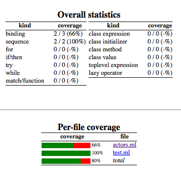
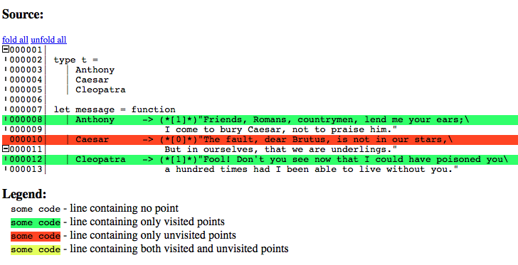

# Bisect Code coverage via PPX.

Instrument `OCaml` code with [Bisect](http://bisect.x9c.fr/) run time tracking information via
[ppx](http://caml.inria.fr/pub/docs/manual-ocaml-4.02/extn.html#sec241). This is a fork of the
original, excellent Bisect library, updated to use the new
[Ast_mapper](https://github.com/ocaml/ocaml/blob/trunk/parsing/ast_mapper.mli) interface and
provide instrumentation just via `ppx` .

[](https://travis-ci.org/rleonid/bisect_ppx)

## Demo

### Files

`actors.ml`:

```OCaml
type t =
  | Anthony
  | Caesar
  | Cleopatra

let message = function
  | Anthony     -> "Friends, Romans, countrymen, lend me your ears;\
                    I come to bury Caesar, not to praise him."
  | Caesar      -> "The fault, dear Brutus, is not in our stars,\
                    But in ourselves, that we are underlings."
  | Cleopatra   -> "Fool! Don't you see now that I could have poisoned you\
                    a hundred times had I been able to live without you."
```

`test.ml`:

```OCaml
open Actors

let () =
  print_endline (message Cleopatra);
  print_endline (message Anthony);
```

### Test

```Bash
# Build with coverage:
$	ocamlfind ocamlc -package bisect_ppx -linkpkg actors.ml test.ml -o test.covered
```

Instrumented `actors.ml`

```OCaml
let _ = Bisect.Runtime.init "actors.ml"
type t =
  | Anthony
  | Caesar
  | Cleopatra
let message =
  function
  | Anthony  ->
      (Bisect.Runtime.mark "actors.ml" 0;
       "Friends, Romans, countrymen, lend me your ears;I come to bury Caesar, not to praise him.")
  | Caesar  ->
      (Bisect.Runtime.mark "actors.ml" 1;
       "The fault, dear Brutus, is not in our stars,But in ourselves, that we are underlings.")
  | Cleopatra  ->
      (Bisect.Runtime.mark "actors.ml" 2;
       "Fool! Don't you see now that I could have poisoned youa hundred times had I been able to live without you.")
```

```Bash
# Run
$ ./test.covered
Fool! Don't you see now that I could have poisoned youa hundred times had I been able to live without you.
Friends, Romans, countrymen, lend me your ears;I come to bury Caesar, not to praise him.

# Create report
$ bisect_report -html report_dir bisect0001.out

# See output
$ open report_dir/index.html
```

### Inspect

Overall



